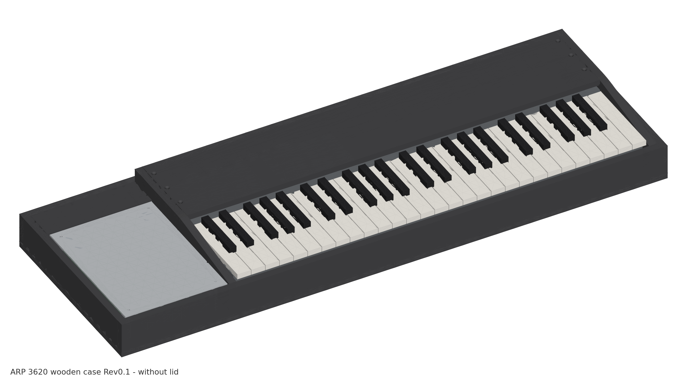
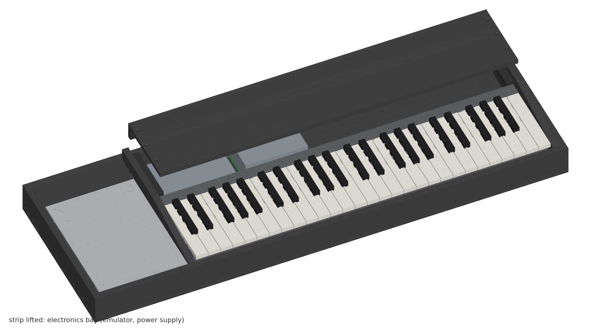
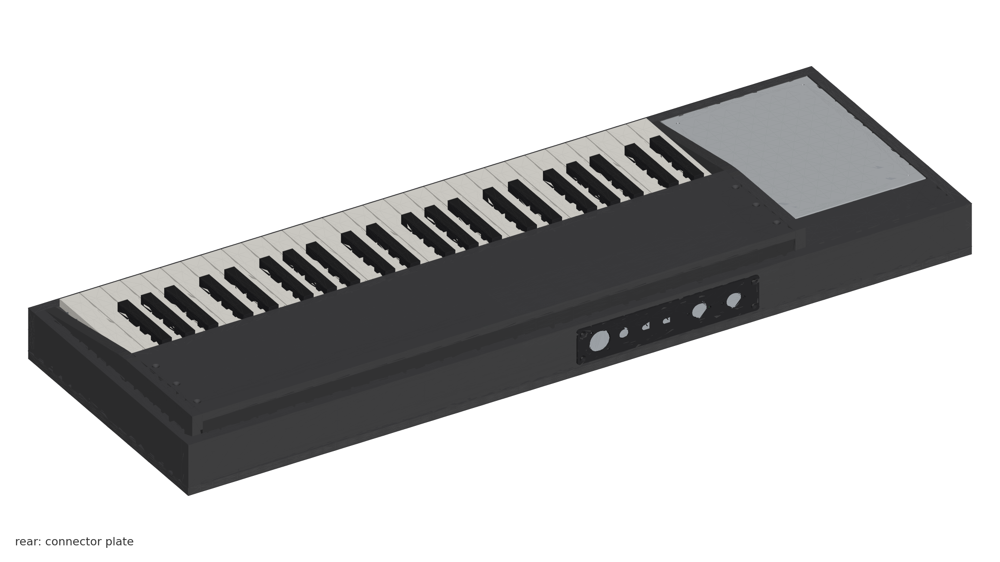

# ARP 3620 replica — wooden case

Wooden enclosure for a DIY replica of the **ARP 3620** duophonic keyboard (the
keyboard of the ARP 2600P), built around a current **Fatar TP/9S 49-key** keybed
instead of the original ARP key mechanism.

Birch plywood covered in black tolex, with a removable lid. Everything is
generated from one parameter file: 3D model with collision checks, a DXF per
part, renders and a 10-sheet production drawing.

**Status: Rev0.1, design stage — not built yet.** Read the open points below
before cutting.



| | |
|---|---|
|  |  |
| Strip lifted: electronics bay | Rear: connector plate |

## Concept

- **Layout as on the original and the 2014 clone:** control panel on the left,
  flush with the walls, keybed on the right between two cheeks, a raised strip
  behind the keys.
- **Heights follow from the keybed.** The keybed stands on two 12 mm risers so
  that the lower edge of the white key fronts sits just above the wall top. This
  leaves 48 mm under the control panel for the 3620 board.
- **Electronics bay behind the keybed**, under the removable strip: bus emulator
  (160 × 110) and power supply board (126 × 80). Cables to the panel section run
  through a notch in the left cheek.
- **Rear connector plate** (aluminium 2 mm) over a window in the rear wall: USB
  (option), DC IN, POWER, SUPPLY 2600/INT, MIDI IN, MIDI OUT. The connection to
  the ARP 2600 (6-pin GX16) sits on the control panel.
- **Lid** sits on the walls and is held by 4 draw latches; 30 mm clear height
  above the walls, 7 mm above the strip.

| | |
|---|---|
| Outside | 911 × 310 mm, walls 59 high, strip 82, with lid 95 (+ feet 12) |
| Material | birch plywood 12 / 9 / 6 mm, black tolex, aluminium rear plate |
| Mass | approx. 5.7 kg wood and plate (lid 1.6 kg), without keybed and electronics |
| Keybed | Fatar TP/9S 49 (683 × 161.5), screwed from below through base and risers |
| Control panel | 170 × 230 × 2 on four M3 standoffs from the base |

## Files

| Path | Content |
|---|---|
| [`production/ARP3620_Woodcase_Rev0.1_drawing.pdf`](production/ARP3620_Woodcase_Rev0.1_drawing.pdf) | Drawing, A3, 10 sheets: overview, general arrangement, sections, every part with dimensions and hole tables, cut list, hardware, assembly |
| [`production/dxf/`](production/dxf/) | One DXF (R12, mm) per distinct part, seen from its front face. Layers `OUTLINE`, `CUTOUT`, `DRILL`, `CSK_FRONT`, `CSK_BACK` (countersink on the far face), `PILOT`, `ENGRAVE` |
| [`production/ARP3620_Woodcase_Rev0.1.step`](production/ARP3620_Woodcase_Rev0.1.step) | All case parts as solids |
| `model/` | FreeCAD file, assembly STEP with simplified reference bodies (keybed, panel, boards), check report, DXF preview |
| `images/` | Renders |
| `scripts/` | Generator, see below |

## How the data are made

Nothing is drawn by hand. `scripts/params.py` holds every dimension,
`scripts/parts.py` describes each part as a flat outline with holes and
cut-outs. From that:

```bash
scripts/make.sh
```

runs `build.py` (FreeCAD: solids, collision and clearance checks, STEP),
`dxf_out.py` and `dxf_preview.py` (DXF, read back with an independent parser),
`render.py` and `drawing.py`. Needs FreeCAD 1.x (`freecadcmd`) and Python 3 with
matplotlib.

**Checked in the 3D model** (`model/check.txt`): every part is a valid solid,
90 part pairs without collision, and the clearances keybed–cheeks 3, keys–front
wall 3, panel all round 2, lid–strip 7, and electronics to strip, apron and rear
plate parts. Countersinks were verified to open to the intended face.

## Open points (check before cutting)

- **Key front height.** The lower edge of the white key fronts, 39 mm above the
  mounting plane, is scaled from the Fatar drawing. All case heights follow
  from it (`KB_LIP` in `params.py`). Measure it on the real keybed first.
- **Keybed screws.** The feet have 4.5 mm holes; screw type and length still to
  be confirmed on the keybed.
- **Space under the control panel.** The 12 mm board spacer and 25 mm for parts
  and plugs under the 3620 board are estimates. Check them with the built board.
- **Rear plate.** The hole sizes are placeholders until the sockets and
  switches are chosen.
- **Hardware.** Latch type, optional handle and case corners.

## Reference: the 2014 clone

The DIY clone from 2014 (Muffwiggler group buy) used a black MDF case,
915 × 257 mm, with a lid. Its drawings were made for a Kimber Allen keybed and
are **not part of this repository** — they are third-party work and stay with
their author. They are attached to the project page in the wiki:
[ARP 3620 Keyboard Clone](https://diysynth.wiki.dsl-man.de/wiki/spaces/DSO/pages/1146915).
This design takes only the overall concept from them; all dimensions are derived
anew from the Fatar keybed and the panel.

## License

© 2026 Dsl-man.de

Licensed under [Creative Commons Attribution-ShareAlike 4.0 International](LICENSE)
(CC BY-SA 4.0), including the generator scripts. You may build, modify and
redistribute this design, commercially too, as long as you credit the source and
share your changes under the same license.

Not covered by this license: third-party documents referred to above (the 2014
case drawings, the Fatar datasheet), which keep their own rights. The keybed
dimensions used here are taken from the Fatar TP/9S datasheet.

ARP and ARP 3620 are names of ARP Instruments, Inc. This is an independent
DIY project, not affiliated with or endorsed by ARP or its successors.
